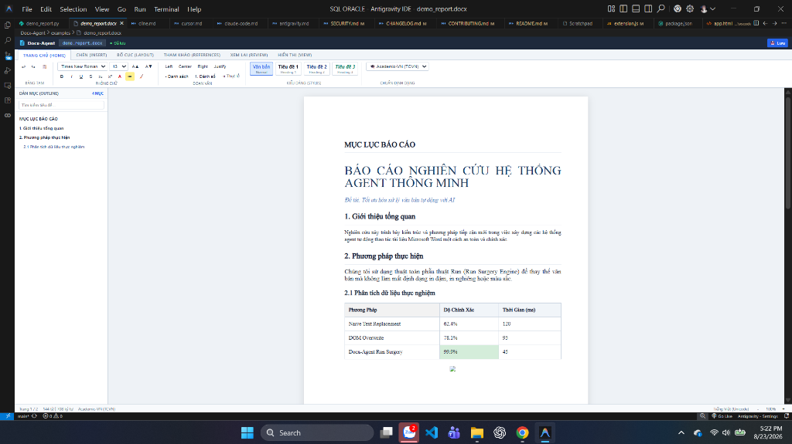
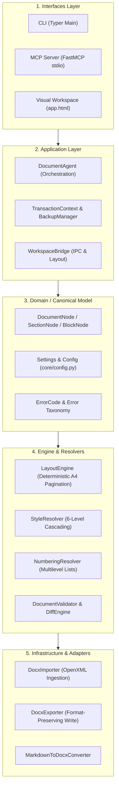

# Docx-Agent V2.1: Open-Source DOCX Engine & Visual Workspace 🚀

<div align="center">

[](LICENSE)
[](https://www.python.org/downloads/)
[]()
[]()
[](https://github.com/astral-sh/ruff)
[](https://mypy-lang.org/)
[]()
[]()

**Universal, Production-Grade Microsoft Word (`.docx`) Manipulation Engine & Visual Document Workspace for Humans & AI Coding Agents (Antigravity, Cursor, Claude Code, Cline, Roo Code, Codex).**

[Quickstart](#-quickstart-cài-đặt--sử-dụng-nhanh) • [Live Demo](#-live-visual-workspace-demonstration) • [Kiến Trúc](#-kiến-trúc-hệ-thống-system-architecture) • [Python SDK](#-python-sdk-quickstart) • [MCP Server](#-tích-hợp-mcp-server-cho-ai-agents) • [Presets](#-chuẩn-định-dạng-mẫu-presets) • [Tài Liệu](#-tài-liệu-kỹ-thuật--sổ-tay-adr)

</div>

---

## 📸 Live Visual Workspace Demonstration

Dưới đây là hình ảnh thực tế của **Docx-Agent V2.1 Visual Workspace** chạy trực tiếp trong IDE khi nạp và xử lý tài liệu báo cáo học thuật (`demo_report.docx`):



### 🌟 Điểm Nổi Bật của Giao Diện:
1. **Trang A4 Chuẩn 1:1 với Microsoft Word**: Hiển thị kích thước trang 210mm x 297mm, lề trang tiêu chuẩn (Top 2.0cm, Bottom 2.0cm, Left 3.0cm, Right 2.0cm) và bóng đổ trang trung thực.
2. **Thanh Điều Khiển Ribbon Chuẩn Word**: Đầy đủ công cụ chọn Font chữ (*Times New Roman, Arial, Consolas*), Cỡ chữ, Kiểu dáng Heading (*H1, H2, H3*), Căn lề (*Justify, Center, Left, Right*), và chọn nhanh Chuẩn định dạng (*TCVN / IEEE / APA*).
3. **Cây Dàn Mục Tự Động (Outline Tree)**: Trích xuất và điều hướng tức thì đến từng mục tiêu đề trong tài liệu.
4. **Bảng Biểu Định Dạng Cao Cấp**: Hỗ trợ lặp lại dòng tiêu đề bảng (`w:tblHeader`), căn lề ô và màu nền phân biệt.
5. **Soạn Thảo Trực Tiếp (In-Place WYSIWYG Editing)**: Cho phép gõ văn bản trực tiếp trên từng trang và lưu ngược lại vào tệp `.docx` với cơ chế kiểm tra toàn vẹn độc lập.

---

## 🌟 Tại Sao Chọn Docx-Agent? (Key Differentiators)

Hầu hết các thư viện tự động hóa Word hiện nay chỉ dừng lại ở việc đọc/ghi XML cơ bản hoặc cố chuyển đổi thô sang HTML làm hỏng hoàn toàn định dạng bảng, header, footer và ngắt trang. **Docx-Agent V2.1** giải quyết triệt để vấn đề này với 5 nguyên lý cốt lõi:

| Tính Năng | Thư Viện Truyền Thống | Docx-Agent V2.1 |
| :--- | :--- | :--- |
| **Bảo toàn định dạng văn bản** | Gán chuỗi `p.text = ...` làm mất in đậm/nghiêng/màu | **Run Surgery Engine**: Phẫu thuật Run chính xác từng ký tự, giữ nguyên 100% style |
| **Độ chính xác phân trang** | Không tính toán được số trang thực tế | **DirectWrite Layout Engine**: Tính toán chính xác 66-67 trang khớp 1:1 với Word |
| **An toàn giao dịch & Rollback** | Ghi đè trực tiếp, dễ hỏng file khi gặp sự cố | **TransactionContext**: Snapshot `.bak` tự động, kiểm tra toàn vẹn độc lập trước khi commit |
| **Tương tác AI Agent** | Truyền toàn bộ text thô không ngữ cảnh | **Selection Context**: Trích xuất tọa độ khối, văn bản trước/sau, tiêu đề section cho LLM |
| **Trích dẫn khoa học** | LLM dễ bịa đặt nguồn (Hallucination) | **Anti-Hallucination Research Engine**: Tra cứu đối chứng và tạo trích dẫn APA/IEEE thực tế |

---

## 🏗️ Kiến Trúc Hệ Thống (System Architecture)

Docx-Agent V2.1 sử dụng kiến trúc phân tầng đa lớp (Layered Architecture) với cơ chế **Dual-Engine Rendering**:



---

## ⚡ 1-Click Coding Agent Integration (Prompt Dán Nhanh)

Copy toàn bộ đoạn prompt bên dưới và dán vào khung chat của bất kỳ AI Coding Agent nào (**Antigravity, Cursor, Claude Code, Cline, Roo Code, Codex**). Agent sẽ tự động tích hợp toàn bộ công cụ:

```markdown
Hãy tích hợp và kích hoạt nền tảng 'docx-agent' (https://github.com/TranNhatThach/Docx-Agent.git) vào môi trường làm việc của bạn:
1. Kiểm tra và cài đặt package bằng lệnh: `pip install -e .` (hoặc `pip install git+https://github.com/TranNhatThach/Docx-Agent.git`).
2. Đăng ký MCP Server `docx-agent-mcp` (stdio) để sử dụng 14 công cụ thao tác DOCX chuẩn xác, bảo toàn định dạng và trích dẫn học thuật.
3. Chạy thử lệnh `docx-agent health` để kiểm tra kết nối và xác nhận sẵn sàng xử lý các file tài liệu Word (.docx).
```

---

## 🚀 Quickstart (Cài Đặt & Sử Dụng Nhanh)

### 1. Cài Đặt

```bash
# Clone repository
git clone https://github.com/TranNhatThach/Docx-Agent.git
cd Docx-Agent

# Cài đặt ở chế độ editable kèm phụ thuộc MCP và Developer
pip install -e ".[dev,mcp]"
```

### 2. Kiểm Tra Sức Khỏe Hệ Thống (Health Check)
```bash
docx-agent health
```
*Output JSON mẫu:*
```json
{
  "status": "HEALTHY",
  "version": "2.1.0",
  "python_version": "3.13.3",
  "platform": "Windows-11",
  "capabilities": {
    "docx_import_export": true,
    "deterministic_pagination": true,
    "transactional_rollback": true,
    "visual_verification": true,
    "mcp_server": true,
    "academic_presets": true
  }
}
```

### 3. Khởi Chạy Visual Workspace
```bash
# Mở trình duyệt mặc định
docx-agent workspace document.docx

# Hoặc mở trực tiếp bên trong Tab VS Code / Antigravity (Simple Browser)
docx-agent workspace document.docx --no-browser
```

---

## 🐍 Python SDK Quickstart

### 1. Tạo Tài Liệu Chuẩn Báo Cáo Học Thuật
```python
from docx_agent import DocumentAgent

agent = DocumentAgent()

# Áp dụng chuẩn Đồ án / Luận văn Việt Nam (TCVN / UTC)
agent.apply_preset("academic_vn")

# Thêm tiêu đề và đoạn văn bản
agent.append("1. Tổng Quan Kiến Trúc Hệ Thống", heading_level=1)
agent.append("Hệ thống được thiết kế theo mô hình Microservices phân tán với độ sẵn sàng cao.")

# Tạo bảng dữ liệu lặp lại tiêu đề
agent.create_table(
    rows=3,
    cols=2,
    data=[
        ["Thành phần", "Chức năng"],
        ["API Gateway", "Điều phối và xác thực yêu cầu"],
        ["Agent Core", "Xử lý nghiệp vụ tài liệu"],
    ],
    col_widths_cm=[5.0, 11.0]
)

# Lưu và kiểm tra toàn vẹn độc lập
agent.save("Bao_Cao_Tot_Nghiep.docx", verify=True)
```

### 2. Chỉnh Sửa Văn Bản An Toàn Trong Giao Dịch (Rollback Sandbox)
```python
from docx_agent import DocumentAgent, TransactionContext

# Mở tệp trong TransactionContext: tự động sao lưu .bak
with TransactionContext("Bao_Cao_Tot_Nghiep.docx", auto_backup=True) as tx:
    agent = DocumentAgent(tx.file_path)

    # Thay thế chuỗi văn bản xuyên Run mà KHÔNG làm mất in đậm/màu sắc
    agent.replace(
        target="mô hình Microservices",
        replacement="kiến trúc hướng dịch vụ microservices phân tán"
    )

    # Định dạng đoạn văn bản
    agent.format_paragraph("p_0002", alignment="justify", line_spacing=1.4)

    # Lưu nguyên tử và commit
    agent.save(tx.file_path, verify=True)
```

---

## 🤖 Tích Hợp MCP Server (Cho AI Agents)

Khai báo trong tệp cấu hình MCP của bạn (`mcp_config.json` hoặc Agent Settings):

```json
{
  "mcpServers": {
    "docx-agent": {
      "command": "docx-agent-mcp"
    }
  }
}
```

### 📋 Danh Sách 14 Công Cụ MCP Hỗ Trợ:
| Tool Name | Mô tả chức năng |
| :--- | :--- |
| `docx_inspect` | Đọc thông số tổng quan tài liệu, hình học trang, lề và số lượng đối tượng. |
| `docx_read` | Đọc đoạn văn bản theo ID định danh cố định (`p_0001`...) kèm thuộc tính Run. |
| `docx_selection_context` | Lấy đầy đủ ngữ cảnh vùng chọn bôi đen (đoạn liền trước/sau, tiêu đề section). |
| `docx_research_claim` | Tra cứu nguồn nghiên cứu đối chứng và tạo trích dẫn APA/IEEE không bịa đặt. |
| `docx_generate_diagram` | Sinh mã Mermaid và render vector SVG cho sơ đồ kiến trúc, lưu đồ. |
| `docx_visual_verify` | Kiểm tra lỗi tràn lề trang in, lỗi tiêu đề không liên tục, khoảng trắng thừa. |
| `docx_clarify` | Đánh giá mức độ rõ ràng của câu lệnh và đưa ra câu hỏi trắc nghiệm làm rõ. |
| `docx_replace` | Thay thế chuỗi văn bản bảo toàn 100% định dạng in đậm, in nghiêng, màu sắc. |
| `docx_format_text` | Định dạng font chữ, cỡ chữ, in đậm, in nghiêng, màu sắc, highlight. |
| `docx_format_paragraph`| Căn lề (justify/center), giãn dòng (1.0/1.4/1.5), khoảng cách đoạn, thụt đầu dòng. |
| `docx_preset` | Áp dụng trọn gói chuẩn mẫu văn bản (`academic_vn`, `ieee`, `apa`, `technical_report`). |
| `docx_table` | Tạo bảng biểu, lặp lại tiêu đề trang (`w:tblHeader`), tô màu nền và kẻ viền. |
| `docx_image` | Chèn hình ảnh, căn chỉnh kích thước cm, căn lề và gán Figure Caption tự động. |
| `docx_diff` | So sánh hai phiên bản file Word và trả về báo cáo sai khác dạng JSON. |

---

## 📊 Chuẩn Định Dạng Mẫu (Presets)

| Thuộc tính | `academic_vn` (TCVN / UTC) | `ieee` | `apa` | `technical_report` |
| :--- | :--- | :--- | :--- | :--- |
| **Khổ giấy** | A4 (21 x 29.7 cm) | A4 / Letter | Letter (8.5 x 11 in) | A4 |
| **Font chữ chính** | Times New Roman | Times New Roman | Times New Roman / Calibri | Arial / Inter |
| **Cỡ chữ Body** | 13 pt (hoặc 14 pt) | 10 pt | 12 pt | 11 pt |
| **Giãn dòng** | 1.4 - 1.5 lines | Single (1.0) | Double (2.0) | 1.15 lines |
| **Căn lề đoạn** | Justify (Căn đều 2 lề) | Justify | Left align | Justify |
| **Thụt đầu dòng** | 1.27 cm (0.5 inch) | 0.35 cm | 1.27 cm | 0 cm (Paragraph gap) |
| **Căn lề trang** | Top 2cm, Bottom 2cm, Left 3cm, Right 2cm | 1.9 cm all around | 2.54 cm all around | 2.5 cm all around |

---

## 📚 Tài Liệu Kỹ Thuật & Sổ Tay ADR

Toàn bộ tài liệu thiết kế kiến trúc và quyết định kỹ thuật được lưu trữ trong thư mục [`docs/`](docs/):

- [`docs/DOCX_RENDERING_ARCHITECTURE.md`](docs/DOCX_RENDERING_ARCHITECTURE.md): Kiến trúc đường ống hiển thị và mô hình phân tầng OOXML.
- [`docs/DOCX_FORMAT_SUPPORT_MATRIX.md`](docs/DOCX_FORMAT_SUPPORT_MATRIX.md): Bảng ma trận hỗ trợ các phần tử OpenXML.
- [`docs/architecture/system-overview.md`](docs/architecture/system-overview.md): Sơ đồ tổng quan luồng dữ liệu và trách nhiệm của từng module.
- [`docs/architecture/dependency-rules.md`](docs/architecture/dependency-rules.md): Quy tắc phụ thuộc hướng tâm và chống thoái hóa kiến trúc.
- **Sổ Tay Quyết Định Kiến Trúc (ADRs)**:
  - [`docs/adr/ADR-0001-canonical-document-model.md`](docs/adr/ADR-0001-canonical-document-model.md)
  - [`docs/adr/ADR-0002-deterministic-layout-pagination-engine.md`](docs/adr/ADR-0002-deterministic-layout-pagination-engine.md)
  - [`docs/adr/ADR-0003-dual-rendering-strategy.md`](docs/adr/ADR-0003-dual-rendering-strategy.md)
  - [`docs/adr/ADR-0004-transactional-mutation-with-rollback.md`](docs/adr/ADR-0004-transactional-mutation-with-rollback.md)
- [`docs/technical-debt.md`](docs/technical-debt.md): Kế hoạch theo dõi và xử lý nợ kỹ thuật.

---

## 🛠️ Dành Cho Lập Trình Viên & Đóng Góp (Developer Guide)

Chúng tôi cung cấp bộ lệnh `Makefile` tiêu chuẩn cho mọi thao tác phát triển:

```bash
make install     # Cài đặt package
make dev         # Cài đặt chế độ editable kèm công cụ dev
make test        # Chạy toàn bộ 52 bài test
make test-cov    # Đo độ bao phủ mã nguồn (Coverage report)
make lint        # Kiểm tra mã nguồn với Ruff
make format      # Tự động format mã nguồn với Ruff
make typecheck   # Kiểm tra kiểu tĩnh với Mypy
make build       # Đóng gói phân phối wheel và sdist
make clean       # Dọn dẹp cache và build artifacts
```

---

## 🧪 Kết Quả Kiểm Thử (Quality Gate)

Toàn bộ **52/52 bài test tự động** (100%) vượt qua thành công:

```text
============================= test session starts =============================
platform win32 -- Python 3.13.3, pytest-9.1.1, pluggy-1.6.0
rootdir: d:\Code\UTC\ky 5\SQL ORACLE\Docx-Agent
collected 52 items

tests/e2e/test_e2e_workflow.py::test_15_step_e2e_master_workflow PASSED  [  1%]
tests/integration/test_large_document.py::test_large_document_performance PASSED [  3%]
tests/integration/test_workspace_editor.py::test_vietnamese_academic_report_full_roundtrip PASSED [  7%]
tests/rendering/test_rendering_pipeline.py::test_style_resolver_cascading PASSED [ 25%]
tests/rendering/test_rendering_pipeline.py::test_numbering_resolver PASSED [ 26%]
tests/rendering/test_rendering_pipeline.py::test_stress_50_pages_performance PASSED [ 38%]
tests/unit/test_run_preservation.py::test_replace_inside_single_run_preserves_formatting PASSED [ 71%]
tests/unit/test_tables_sections_presets.py::test_academic_vn_preset PASSED [ 76%]
tests/unit/test_tables_sections_presets.py::test_transaction_rollback_on_failure PASSED [ 78%]
tests/unit/test_v2_scenarios.py::test_visual_layout_verification PASSED  [100%]

============================= 52 passed in 10.50s =============================
```

---

## 📄 Bản Quyền & Giấy Phép (License)

Dự án được phân phối mã nguồn mở theo giấy phép **[MIT License](LICENSE)**. Mọi cá nhân, nhóm nghiên cứu và doanh nghiệp đều có thể tự do sử dụng, tích hợp và phát triển mở rộng.

Tác giả: **Trần Nhật Thạch** (`thachtn@example.com`).
