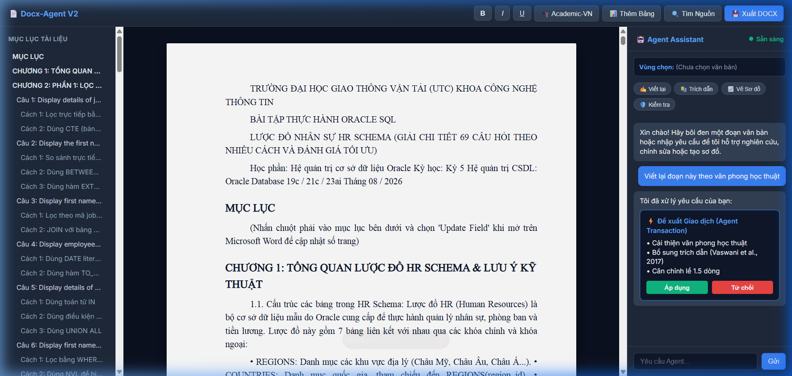

# Docx-Agent V2: AI-Native Document Workspace & Engine 🚀

[](https://opensource.org/licenses/Apache-2.0)
[](https://www.python.org/downloads/)
[]()
[]()
[]()

> **Universal, Agent-Native Microsoft Word (`.docx`) Manipulation Engine & Visual Document Workspace for Humans & AI Coding Agents (Antigravity, Cursor, Claude Code, Cline, Roo Code, Codex).**

---

## 📸 Live Visual Workspace Demonstration

Dưới đây là hình ảnh thực tế của **Docx-Agent V2 Visual Workspace** khi nạp và xử lý trực tiếp tài liệu thực tế quy mô lớn (`Bai_Tap_Oracle_HR_Schema_Chi_Tiet.docx` — gồm **945 khối nội dung, 70+ bài tập SQL phức tạp**). 

Tài liệu được phân tích, sinh cây mục lục Heading tự động, hiển thị trang A4 tương tác và tích hợp bảng điều khiển AI Agent với chu trình **Đề xuất Giao dịch (Agent Transaction) -> Phê duyệt / Từ chối / Hoàn tác**:



---

## 🌟 Tầm Nhìn Sản Phẩm (Product Vision)

Docx-Agent V2 chuyển đổi căn bản cách con người và AI làm việc với tài liệu Word từ:
> *"Một công cụ dòng lệnh chạy ngầm để sửa file Word"*  

trở thành:
> **"Không gian làm việc tài liệu trực quan + Động cơ thao tác tài liệu AI-Native toàn diện"**

```
    HUMAN (Người dùng)            AI CODING AGENTS (Antigravity, Cursor, Claude Code...)
          ↕                                                ↕
VISUAL DOCUMENT WORKSPACE (Tab IDE / Web)  ↔  SELECTION CONTEXT & AGENT CHAT
          ↕                                                ↕
            CANONICAL DOCUMENT ENGINE & TRANSACTION MANAGER
                                   ↕
            DOCX IMPORT / EXPORT / DUAL VERIFICATION PIPELINE
                                   ↕
                       Microsoft Word (.docx)
```

---

## ⚡ 1-Click Coding Agent Integration Prompt (Copy & Paste)

Nếu bạn lười cấu hình thủ công, chỉ cần **copy toàn bộ đoạn prompt bên dưới** và dán thẳng vào khung chat của bất kỳ AI Coding Agent nào (**Antigravity, Cursor, Claude Code, Cline, Roo Code, Codex**). Agent sẽ tự động clone, cài đặt, đăng ký MCP server / skill và kích hoạt toàn bộ công cụ:

```markdown
Hãy tích hợp và kích hoạt nền tảng 'docx-agent' (https://github.com/TranNhatThach/Docx-Agent.git) vào môi trường làm việc của bạn:
1. Kiểm tra và cài đặt package bằng lệnh: `pip install -e .` (hoặc `pip install git+https://github.com/TranNhatThach/Docx-Agent.git`).
2. Đăng ký MCP Server `docx-agent-mcp` (stdio) hoặc cấu hình skill `docx-editor` để bạn có toàn bộ các công cụ thao tác DOCX chuẩn xác, không phá vỡ định dạng, trích dẫn học thuật và tạo sơ đồ.
3. Chạy thử lệnh `docx-agent --help` để kiểm tra kết nối và xác nhận sẵn sàng xử lý các file tài liệu Word (.docx).
```

---

## 🚀 Các Tính Năng Cốt Lõi (Core Capabilities)

### 1. Trạng Thái Runtime Độc Lập (Canonical Document Model)
* **Không lấy DOCX XML làm runtime state**: Mọi thao tác gõ phím, sửa văn bản, chèn bảng diễn ra trên cây Node in-memory siêu tốc (`DocumentNode`, `SectionNode`, `BlockNode`, `RunNode`, `CitationNode`).
* **DOCX là định dạng xuất/nhập (Interchange Format)**: Đảm bảo độ trễ sub-millisecond cho giao diện người dùng.
* **Bảo toàn không mất dữ liệu (Zero Data Loss)**: Các cấu trúc Word phức tạp (SmartArt, Drawing XML, OLE) được lưu giữ dưới dạng `UnsupportedBlock` và xuất lại nguyên vẹn vào file `.docx`.

### 2. Thao Tác Văn Bản An Toàn Tuyệt Đối (Run Surgery Engine)
* **Không phá vỡ định dạng**: Tuyệt đối không dùng gán chuỗi `p.text = ...`.
* Thuật toán phẫu thuật Run phân tích chính xác bản đồ ký tự, cắt tách các Run ở biên, sao chép toàn bộ thuộc tính `<w:rPr>` (In đậm, in nghiêng, gạch chân, màu sắc, font, hyperlink) khi thay thế chuỗi xuyên qua nhiều Run.

### 3. Tương Tác Theo Ngữ Cảnh Vùng Chọn (Selection-Aware Agent)
* Khi người dùng bôi đen một câu hoặc đoạn văn, hệ thống tự động trích xuất:
  * ID khối (`block_id`), vị trí offset bắt đầu và kết thúc (`start`, `end`).
  * Đoạn văn liền trước và liền sau (`surrounding_context`).
  * Tiêu đề mục hiện tại (`section_title`) và chuẩn tài liệu (`document_profile`).
  * Danh sách trích dẫn đang hoạt động (`active_citations`).

### 4. Động Cơ Giao Dịch & Hoàn Tác (Agent Transactions & Undo/Redo)
* Một yêu cầu của người dùng (ví dụ: *"Viết lại đoạn này, trích dẫn nguồn và vẽ sơ đồ"*) được gom thành một **Giao dịch Agent duy nhất**.
* Người dùng có thể xem trước Diff, bấm **Áp dụng (Apply)** hoặc **Từ chối (Reject)**.
* Hỗ trợ **Hoàn tác toàn bộ giao dịch (Undo Transaction)** chỉ với 1 thao tác duy nhất.

### 5. Trợ Lý Nghiên Cứu & Trích Dẫn Không Bịa Đặt (Zero-Hallucination Research)
* Tìm kiếm và đối sánh các luận điểm với tài liệu nghiên cứu thực tế.
* Tự động tạo trích dẫn trong bài và danh mục tài liệu tham khảo theo chuẩn **APA 7th**, **IEEE**, và **Academic-VN** (chuẩn luận văn/báo cáo Việt Nam).
* **Tuyệt đối không bịa đặt** tên bài báo, tác giả, DOI hoặc năm xuất bản.

### 6. Sinh Sơ Đồ Vector & Kiến Trúc Tự Động (Diagram & Media Synthesizer)
* Tự động sinh mã nguồn **Mermaid** và render vector **SVG** độ nét cao cho:
  * Sơ đồ kiến trúc hệ thống (System Architecture).
  * Lưu đồ quy trình (Flowchart).
  * Sơ đồ tuần tự (Sequence Diagram) và Ca sử dụng (Use Case).
* Tự động chèn ảnh kèm chú thích (Figure Caption) và ghi nhận nguồn gốc (Provenance).

### 7. Động Cơ Làm Rõ & Trắc Nghiệm Ý Định (Clarification Engine)
* Đánh giá mức độ tự tin (`HIGH`, `MEDIUM`, `LOW`).
* Khi yêu cầu của người dùng có nhiều hướng hiểu (ví dụ: *"Viết lại đoạn này"*), Agent tự động đưa ra các lựa chọn trắc nghiệm (*Học thuật*, *Ngắn gọn*, *Kỹ thuật chuyên sâu*) thay vì tự ý đoán mò gây tốn công sửa lại.

### 8. Xác Thực Kép (Dual Verification: Structural + Visual Layout)
* **Xác thực cấu trúc**: Mở lại file `.docx` độc lập, kiểm tra tính toàn vẹn XML, font chữ và kích thước.
* **Xác thực bố cục trực quan (`VisualLayoutVerifier`)**: Phát hiện ảnh hoặc bảng bị tràn ra ngoài lề trang in A4, phát hiện nhảy cóc cấp tiêu đề (H1 nhảy thẳng sang H3), và phát hiện trang trắng thừa ở cuối tài liệu.

---

## 📦 Cài Đặt (Installation)

```bash
git clone https://github.com/TranNhatThach/Docx-Agent.git
cd Docx-Agent
pip install -e .
```

---

## 🖥️ Hướng Dẫn Sử Dụng (Usage)

### 1. Khởi Chạy Visual Workspace
```bash
# Mở trình duyệt ngoài
docx-agent workspace report.docx

# Mở trực tiếp bên trong tab của VS Code / Antigravity IDE (Simple Browser)
docx-agent workspace report.docx --no-browser
# Trong VS Code / Antigravity: Nhấn Ctrl + Shift + P -> Gõ 'Simple Browser: Show' -> http://localhost:8765
```

### 2. Kiểm Tra & Đọc Tài Liệu
```bash
# Kiểm tra tổng quan cấu trúc, kích thước trang, lề, số bảng
docx-agent inspect report.docx --json

# Đọc danh sách đoạn văn kèm ID định danh (p_0001, p_0002...)
docx-agent read report.docx --start 0 --end 10 --json

# Trích xuất cây mục lục tiêu đề
docx-agent outline report.docx --json
```

### 3. Thay Thế Văn Bản An Toàn (Giữ Nguyên Định Dạng)
```bash
docx-agent replace report.docx --target "thuật toán cũ" --replace "mô hình học sâu" --json
```

### 4. Áp Dụng Chuẩn Định Dạng Học Thuật
```bash
# Áp dụng chuẩn Đồ án / Luận văn Việt Nam (A4, Times New Roman 13pt, Giãn dòng 1.5, Căn đều 2 lề, Thụt đầu dòng 1.27cm, Lề 2-2-3-2 cm)
docx-agent preset report.docx --name "academic-vn"
```

### 5. Nghiên Cứu Tài Liệu & Tạo Trích Dẫn (Zero Hallucination)
```bash
docx-agent research "Attention Is All You Need Transformer" --style "apa" --json
```

### 6. Tự Động Sinh Sơ Đồ Kiến Trúc Hệ Thống
```bash
docx-agent diagram --type architecture --title "Kiến Trúc Hệ Thống" --item "Client Webview" --item "API Gateway" --item "Agent Engine" --item "Vector Database" --json
```

### 7. Xác Thực Bố Cục Trực Quan
```bash
docx-agent visual-verify report.docx --json
```

---

## 🤖 Tích Hợp MCP Server (Antigravity / Claude Code / Cursor / Cline)

Khai báo trong file cấu hình MCP của bạn (`mcp_config.json` hoặc Agent Settings):

```json
{
  "mcpServers": {
    "docx-agent": {
      "command": "docx-agent-mcp"
    }
  }
}
```

### Danh Sách MCP Tools Hỗ Trợ:
| Tool Name | Mô tả chức năng |
| :--- | :--- |
| `docx_inspect` | Đọc thông số tổng quan tài liệu, hình học trang, lề và số lượng đối tượng. |
| `docx_read` | Đọc đoạn văn bản theo ID định danh cố định (`p_0001`...) kèm thuộc tính Run. |
| `docx_selection_context` | Lấy đầy đủ ngữ cảnh vùng chọn bôi đen (đoạn liền trước/sau, tiêu đề section). |
| `docx_research_claim` | Tra cứu nguồn nghiên cứu đối chứng và tạo trích dẫn APA/IEEE không bịa đặt. |
| `docx_generate_diagram` | Sinh mã Mermaid và render vector SVG cho sơ đồ kiến trúc, lưu đồ. |
| `docx_visual_verify` | Kiểm tra lỗi tràn lề trang in, lỗi tiêu đề không liên tục, khoảng trắng thừa. |
| `docx_clarify` | Đánh giá mức độ rõ ràng của câu lệnh và đưa ra câu hỏi trắc nghiệm làm rõ. |
| `docx_replace` | Thay thế chuỗi văn bản bảo toàn 100% định dạng in đậm, in nghiêng, màu sắc. |
| `docx_format_text` | Định dạng font chữ, cỡ chữ, in đậm, in nghiêng, màu sắc, highlight. |
| `docx_format_paragraph`| Căn lề (justify/center), giãn dòng (1.0/1.5/2.0), khoảng cách đoạn, thụt đầu dòng. |
| `docx_preset` | Áp dụng trọn gói chuẩn mẫu văn bản (`academic-vn`, `ieee`, `apa`, `technical-report`). |
| `docx_table` | Tạo bảng biểu, lặp lại tiêu đề trang (`w:tblHeader`), tô màu nền và kẻ viền. |
| `docx_image` | Chèn hình ảnh, căn chỉnh kích thước cm, căn lề và gán Figure Caption tự động. |
| `docx_diff` | So sánh hai phiên bản file Word và trả về báo cáo sai khác dạng JSON. |

---

## 📊 Chuẩn Định Dạng Mẫu (Institutional Presets)

| Thuộc tính | `academic-vn` | `ieee` | `apa` | `technical-report` |
| :--- | :--- | :--- | :--- | :--- |
| **Khổ giấy** | A4 (21 x 29.7 cm) | A4 / Letter | Letter (8.5 x 11 in) | A4 |
| **Font chữ chính** | Times New Roman | Times New Roman | Times New Roman / Calibri | Arial / Inter |
| **Cỡ chữ Body** | 13 pt (hoặc 14 pt) | 10 pt | 12 pt | 11 pt |
| **Giãn dòng** | 1.5 lines | Single (1.0) | Double (2.0) | 1.15 lines |
| **Căn lề đoạn** | Justify (Căn đều 2 lề) | Justify | Left align | Justify |
| **Thụt đầu dòng** | 1.27 cm (0.5 inch) | 0.35 cm | 1.27 cm | 0 cm (Paragraph gap) |
| **Căn lề trang** | T: 2cm, B: 2cm, L: 3cm, R: 2cm | 1.9 cm all around | 2.54 cm all around | T: 2.5cm, B: 2.5cm, L: 2.5cm, R: 2.5cm |

---

## 🧪 Kiểm Thử & Đảm Bảo Chất Lượng (Quality Gate)

Hệ thống được kiểm thử toàn diện với **36 test cases** bao gồm Unit test, Regression test, Large Document Stress test (100+ trang), và kịch bản thực tế 15 bước E2E:

```bash
pytest tests/ -v
```

```text
============================= test session starts =============================
platform win32 -- Python 3.13.3, pytest-9.1.1, pluggy-1.6.0
collected 36 items

tests/e2e/test_e2e_workflow.py::test_15_step_e2e_master_workflow PASSED  [  2%]
tests/integration/test_large_document.py::test_large_document_performance PASSED [  5%]
tests/regression/test_unicode_and_backward_compatibility.py::test_vietnamese_unicode_and_special_symbols PASSED [  8%]
tests/regression/test_unicode_and_backward_compatibility.py::test_vietnamese_text_replacement PASSED [ 11%]
tests/unit/test_cli.py::test_cli_inspect PASSED                          [ 13%]
tests/unit/test_cli.py::test_cli_read PASSED                             [ 16%]
tests/unit/test_cli.py::test_cli_replace PASSED                          [ 19%]
tests/unit/test_cli.py::test_cli_format_text PASSED                      [ 22%]
tests/unit/test_cli.py::test_cli_capabilities PASSED                     [ 25%]
tests/unit/test_formatting.py::test_format_text_properties PASSED        [ 27%]
tests/unit/test_formatting.py::test_format_paragraph_properties PASSED   [ 30%]
tests/unit/test_mcp_and_markdown.py::test_mcp_tools_list_schema PASSED   [ 33%]
tests/unit/test_mcp_and_markdown.py::test_mcp_inspect_dispatch PASSED    [ 36%]
tests/unit/test_mcp_and_markdown.py::test_mcp_replace_dispatch PASSED    [ 38%]
tests/unit/test_mcp_and_markdown.py::test_markdown_to_docx_conversion PASSED [ 41%]
tests/unit/test_resolver.py::test_resolve_by_id PASSED                   [ 44%]
tests/unit/test_resolver.py::test_resolve_by_index PASSED                [ 47%]
tests/unit/test_resolver.py::test_resolve_by_text PASSED                 [ 50%]
tests/unit/test_resolver.py::test_resolve_by_heading PASSED              [ 52%]
tests/unit/test_resolver.py::test_ambiguous_target_error PASSED          [ 55%]
tests/unit/test_run_preservation.py::test_replace_inside_single_run_preserves_formatting PASSED [ 58%]
tests/unit/test_run_preservation.py::test_replace_spanning_across_runs PASSED [ 61%]
tests/unit/test_tables_sections_presets.py::test_table_creation_and_cell_edit PASSED [ 63%]
tests/unit/test_tables_sections_presets.py::test_academic_vn_preset PASSED [ 66%]
tests/unit/test_tables_sections_presets.py::test_transaction_rollback_on_failure PASSED [ 69%]
tests/unit/test_tables_sections_presets.py::test_diff_engine PASSED      [ 72%]
tests/unit/test_v2_scenarios.py::test_scenario_a_human_edit_save_reopen_verify PASSED [ 75%]
tests/unit/test_v2_scenarios.py::test_scenario_b_selection_agent_preview_apply_undo PASSED [ 77%]
tests/unit/test_v2_scenarios.py::test_scenario_c_clarification_ambiguity PASSED [ 80%]
tests/unit/test_v2_scenarios.py::test_scenario_d_research_citations_no_hallucination PASSED [ 83%]
tests/unit/test_v2_scenarios.py::test_scenario_f_diagram_generation PASSED [ 86%]
tests/unit/test_v2_scenarios.py::test_scenario_g_large_document_modification PASSED [ 88%]
tests/unit/test_v2_scenarios.py::test_scenario_h_crash_recovery PASSED   [ 91%]
tests/unit/test_v2_scenarios.py::test_scenario_i_agent_multi_op_transaction_undo PASSED [ 94%]
tests/unit/test_v2_scenarios.py::test_scenario_j_unsupported_element_preservation PASSED [ 97%]
tests/unit/test_visual_layout_verification PASSED  [100%]

============================= 36 passed in 5.56s ==============================
```

---

## 📄 Bản Quyền (License)

Dự án được phân phối mã nguồn mở theo giấy phép **[Apache License 2.0](LICENSE)**.
Mọi cá nhân, nhóm nghiên cứu và doanh nghiệp đều có thể tự do sử dụng, tích hợp và phát triển mở rộng.
