# Kiến Trúc Pipeline Rendering DOCX Cho Docx-Agent V2.1

## 1. Tổng Quan Kiến Trúc (Executive Summary)

Docx-Agent V2.1 sử dụng kiến trúc phân tầng chuyên nghiệp, chuyển đổi từ mô hình biên dịch HTML ad-hoc sang **Word-Grade Deterministic Layout & Pagination Engine**.

Mô hình tài liệu chuẩn hóa (**Canonical Document Model**) là nguồn chân lý duy nhất (Single Source of Truth), phân tách hoàn toàn giữa biểu diễn dữ liệu OpenXML, bộ suy diễn kiểu dáng kế thừa, bộ giải toán hình học ngắt trang và tầng hiển thị Webview/Xuất bản Word.

```mermaid
flowchart TD
    A[OpenXML DOCX Package] --> B[DocxImporter & Package Reader]
    B --> C[Canonical Document Model]
    B --> D[styles.xml & numbering.xml]
    D --> E[StyleResolver & NumberingResolver]
    C --> F[Effective Formatting Attachment]
    E --> F
    F --> G[LayoutEngine & Pagination Calculator]
    G --> H[Paginated RenderTree - LayoutDocument]
    H --> I[Webview Visual Workspace - app.html]
    H --> J[DocxExporter & OpenXML Serializer]
    J --> K[Target .docx File & Independent Verifier]
```

---

## 2. Các Tầng Trong Pipeline Xử Lý

### 2.1. Tầng 1: OOXML Ingestion & Package Reader (`adapters/docx.py`)
- **Package Isolation**: Giải nén và nạp trực tiếp các part quan trọng (`styles.xml`, `numbering.xml`, `document.xml`, `settings.xml`).
- **Section Isolation**: Phân định các `w:sectPr` tuần tự, khắc phục hoàn toàn lỗi lặp khối văn bản khi có nhiều section.
- **DrawingML & Extensibility**: Phân giải hình ảnh `w:drawing` / `wp:inline` / `wp:anchor` và bảo toàn các thẻ chưa hỗ trợ dưới dạng `UnsupportedBlock` (`UnknownOOXMLNode`).

### 2.2. Tầng 2: Style & Numbering Resolvers (`engine/styles.py`, `engine/numbering.py`)
- **Thứ tự kế thừa 6 cấp (Cascading Chain)**:
  1. `docDefaults` (w:rPrDefault, w:pPrDefault)
  2. Document Theme Defaults
  3. Base Styles (truy vết chuỗi `w:basedOn`)
  4. Paragraph Style (`w:pPr/w:pStyle`)
  5. Character Style (`w:rPr/w:rStyle`)
  6. Direct Formatting (Định dạng trực tiếp trên đoạn và run).
- **Multilevel Numbering**: Quản lý bộ đếm danh sách đa cấp từ `abstractNum` và `num`, hỗ trợ các định dạng `decimal`, `lowerLetter`, `upperLetter`, `lowerRoman`, `upperRoman`, `bullet` và `lvlText`.

### 2.3. Tầng 3: Deterministic Layout & Pagination Engine (`engine/layout.py`)
- **A4 Geometry**: Tính toán kích thước chuẩn (210mm x 297mm ≈ 595.28pt x 841.89pt) và lề trang theo tiêu chuẩn TCVN (Trái 3.0cm, Phải 2.0cm, Trên 2.0cm, Dưới 2.0cm).
- **Quy tắc ngắt trang**:
  - `page_break_before`: Luôn mở trang mới.
  - Explicit Page Break (`w:br[@w:type='page']`): Tách khối sang trang tiếp theo.
  - `keep_with_next`: Di chuyển tiêu đề cùng các dòng đầu của đoạn văn tiếp theo sang trang sau nếu không đủ chỗ trống để chống mồ côi tiêu đề (Orphan Heading Prevention).
  - Khối lượng bảng & hình ảnh: Tính toán chiều cao thực tế theo số hàng và tỷ lệ khung hình.
- **Section Headers / Footers**:
  - Khi `different_first_page` bật: Trang 1 (Trang bìa) ẩn hoàn toàn Header và Footer.
  - Các trang nội dung: Header căn phải tiêu đề tài liệu, Footer căn phải `Trang X / N` cùng tên đơn vị/khoa.

### 2.4. Tầng 4: Visual Workspace Webview (`app.html`)
- Hiển thị tài liệu dưới dạng danh sách các tờ A4 rời rạc (`.a4-page`), có bóng đổ và khoảng cách thực tế (24px).
- Bỏ hoàn toàn các quy tắc CSS cứng nhắc (`text-indent: 1.27cm` cố định trên tất cả thẻ `p`), áp dụng định dạng trực tiếp từ `effective_properties`.
- Phân tách rõ ràng giữa Code Block (Font Consolas, viền xanh `#0284C7`, nền `#F8FAFC`) và Nhận xét đánh giá (Viền xanh lá `#16A34A`, nền `#F0FDF4`).

---

## 3. Tính Toàn Vẹn Dữ Liệu & Khả Năng Khôi Phục (Roundtrip & Recovery)
- Mọi thao tác từ Antigravity Agent đều được bọc trong `TransactionContext`.
- Trước khi lưu, hệ thống tự động chạy `DocumentValidator` để kiểm tra tính toàn vẹn cấu trúc.
- Sau khi xuất ra `.docx`, `WorkspaceBridge` tự động mở lại file và kiểm tra độc lập (Independent Verification) để đảm bảo tệp không bị rỗng hay lỗi XML.
